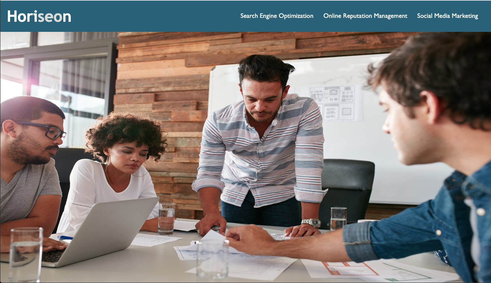

# Module One Challenge: Refactor Starter Code

<!-- Improved compatibility of back to top link: See: https://github.com/othneildrew/Best-README-Template/pull/73 -->

<!-- PROJECT LOGO -->
 

  

<h3 align="center">Horiseon Accessibility Refactor</h3>

  

    Adding semantic HTML and concise CSS to Horiseon's website
     
    <a href="https://github.com/NoahAaronBurton/Accessibility-Refactor"><strong>Explore the docs »</strong></a>
     
     
    <a href="https://noahaaronburton.github.io/Accessibility-Refactor/">View Website on GitHub Pages</a>
    ·
    <a href="https://github.com/NoahAaronBurton/Accessibility-Refactor/issues">Report Bug</a>
    
    
  

<!-- TABLE OF CONTENTS -->

  
Table of Contents

  <ol>
    <li>
      <a href="#about-the-project">About The Project</a>
      <ul>
      </ul>
    </li>
    <li>
      <a href="#getting-started">Getting Started</a>
      <ul>
      </ul>
    </li>
    <li><a href="#license">License</a></li>
    <li><a href="#contact">Contact</a></li>
    <li><a href="#acknowledgments">Acknowledgments</a></li>
  </ol>

<!-- ABOUT THE PROJECT -->
## About The Project

 

This repo contains a refactor of Horiseon's website for SEO and accessibility purposes. This was assigned to me as the Module One Challenge for my coding bootcamp through the University of Utah. I have added semantic HTML elements as well as refactored the CSS for conciseness. 

(<a href="#readme-top">back to top</a>)

<!-- GETTING STARTED -->
## Getting Started

Click "Explore the docs" at the top of this page to view the code on GitHub.
  Or, select "View Website on GitHub Pages" to find the deployed site.

<!-- LICENSE -->
## License

Distributed under the MIT License. See `LICENSE.txt` for more information.

(<a href="#readme-top">back to top</a>)

<!-- CONTACT -->
## Contact

Noah Burton - nburton115@gmail.com

Project Link: [https://github.com/NoahAaronBurton/Accessibility-Refactor](https://github.com/NoahAaronBurton/Accessibility-Refactor)

(<a href="#readme-top">back to top</a>)

<!-- ACKNOWLEDGMENTS -->
## Acknowledgments
<strong>Starter code provided by [Xandromus](https://github.com/coding-boot-camp/urban-octo-telegram) </strong>
 

The following videos were referenced during the refactoring phase of this project
* [ByteGrad on YouTube](https://www.youtube.com/watch?v=bOUhq46fd5g&t=195s&ab_channel=ByteGrad)
* [Hubspot Marketing on Youtube](https://www.youtube.com/watch?v=-jn9aaNn8_I&ab_channel=HubSpotMarketing)

Thank you to [vi-dev0 on Github](https://github.com/vi-dev0) for the README.md template used for this project.

[Link to template repo](https://github.com/othneildrew/Best-README-Template)

(<a href="#readme-top">back to top</a>)

<!-- MARKDOWN LINKS & IMAGES -->
<!-- https://www.markdownguide.org/basic-syntax/#reference-style-links -->
[contributors-shield]: https://img.shields.io/github/contributors/NoahAaronBurton/Accessibility-Refactor.svg?style=for-the-badge
[contributors-url]: https://github.com/NoahAaronBurton/Accessibility-Refactor/graphs/contributors
[forks-shield]: https://img.shields.io/github/forks/NoahAaronBurton/Accessibility-Refactor.svg?style=for-the-badge
[forks-url]: https://github.com/NoahAaronBurton/Accessibility-Refactor/network/members
[stars-shield]: https://img.shields.io/github/stars/NoahAaronBurton/Accessibility-Refactor.svg?style=for-the-badge
[stars-url]: https://github.com/NoahAaronBurton/Accessibility-Refactor/stargazers
[issues-shield]: https://img.shields.io/github/issues/NoahAaronBurton/Accessibility-Refactor.svg?style=for-the-badge
[issues-url]: https://github.com/NoahAaronBurton/Accessibility-Refactor/issues
[license-shield]: https://img.shields.io/github/license/NoahAaronBurton/Accessibility-Refactor.svg?style=for-the-badge
[license-url]: https://github.com/NoahAaronBurton/Accessibility-Refactor/blob/master/LICENSE.txt
[linkedin-shield]: https://img.shields.io/badge/-LinkedIn-black.svg?style=for-the-badge&logo=linkedin&colorB=555
[linkedin-url]: https://linkedin.com/in/linkedin_username
[product-screenshot]: images/screenshot.png
[Next.js]: https://img.shields.io/badge/next.js-000000?style=for-the-badge&logo=nextdotjs&logoColor=white
[Next-url]: https://nextjs.org/
[React.js]: https://img.shields.io/badge/React-20232A?style=for-the-badge&logo=react&logoColor=61DAFB
[React-url]: https://reactjs.org/
[Vue.js]: https://img.shields.io/badge/Vue.js-35495E?style=for-the-badge&logo=vuedotjs&logoColor=4FC08D
[Vue-url]: https://vuejs.org/
[Angular.io]: https://img.shields.io/badge/Angular-DD0031?style=for-the-badge&logo=angular&logoColor=white
[Angular-url]: https://angular.io/
[Svelte.dev]: https://img.shields.io/badge/Svelte-4A4A55?style=for-the-badge&logo=svelte&logoColor=FF3E00
[Svelte-url]: https://svelte.dev/
[Laravel.com]: https://img.shields.io/badge/Laravel-FF2D20?style=for-the-badge&logo=laravel&logoColor=white
[Laravel-url]: https://laravel.com
[Bootstrap.com]: https://img.shields.io/badge/Bootstrap-563D7C?style=for-the-badge&logo=bootstrap&logoColor=white
[Bootstrap-url]: https://getbootstrap.com
[JQuery.com]: https://img.shields.io/badge/jQuery-0769AD?style=for-the-badge&logo=jquery&logoColor=white
[JQuery-url]: https://jquery.com 

